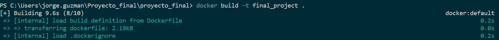
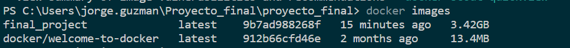
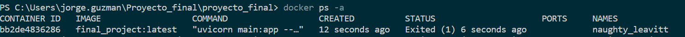

# Project Instructions

This README.md file contains instructions for building, running, debugging, making predictions, and copying logs in the containerized application.

## Build the Image

To build the Docker image, run the following command:

bash docker build -t final_project .

## Check the images 

to check the docker images run the following command

 docker images

## Run the Container

To run the Docker container, execute the following command:

bash docker run -d --rm --name final_project-container -p 3000:8000 final_project

##Check the container information

to check this run the following command

docker ps -a

## Debug the Container

To access the running container and debug it, use the following command:

bash docker exec -it final_project-container bin bash

## Make Predictions on the Local Machine

To make predictions on the local machine using the containerized application, execute the following command:

bash curl http://localhost:3000/predict

## Copy Logs from the Container to the Local Machine

To copy logs from the container to the local machine, run the following command:

docker cp bb2de4836286:debug.log .

## Check Debug Logs

To check the debug logs of the container, you can use the following command:

docker logs -f bb2de4836286 | Select-String -Pattern "Debug"

This command will display the logs generated by the container, including any debug information.

Please ensure that you are in the same directory as the Dockerfile when running these commands.

## Docker Compose

## Create the network

First, create the network AIService by running this command:

## Run Docker Compose

Be sure you are un the directory where the docker-compose.yml file is located

Run next command to start the Server and Frontend APIs

docker-compose up --build

## Run the following code to identify the CONTAINER ID of the Server container.

$docker ps -a

## Save the logs to the local machine

docker cp bb2de4836286:debug.log .

For any further questions or assistance, please don't hesitate to reach out at jorgeadrian.dp@gmail.com.